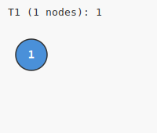
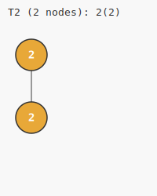
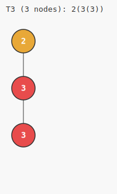
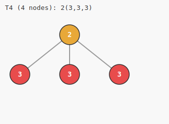
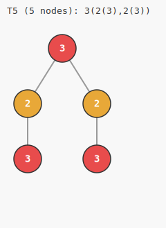
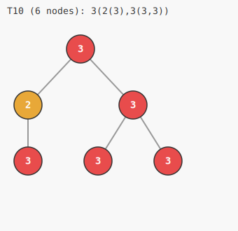
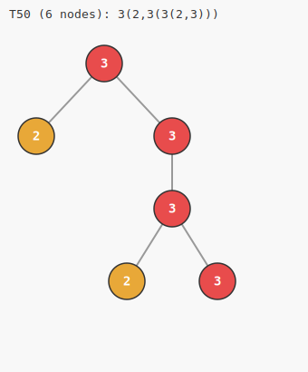
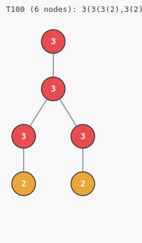
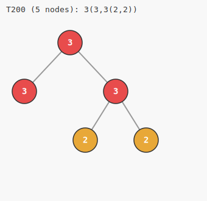

# TREE(3) Sequence Explorer

A Rust CLI that **computes and visualizes candidate initial sequences** for Harvey Friedman's TREE(k) function — one of the most mind-bendingly large numbers in mathematics. This is not a static drawing tool; it actually runs the combinatorial search, checks homeomorphic tree embeddings, and renders each valid tree as an SVG file.

| T1 | T2 | T3 | T4 | T5 |
|:--:|:--:|:--:|:--:|:--:|
|  |  |  |  |  |
| `1` | `2(2)` | `2(3(3))` | `2(3,3,3)` | `3(2(3),2(3))` |

| T10 | T50 | T100 | T200 |
|:---:|:---:|:----:|:----:|
|  |  |  |  |
| `3(2(3),3(3,3))` | `3(2,3(3(2,3)))` | `3(3(3(2),3(2)))` | `3(3,3(2,2))` |

---

## Table of Contents

1. [What is TREE(3)?](#1-what-is-tree3)
2. [Original Specification](#2-original-specification)
3. [Mathematical Model](#3-mathematical-model)
4. [Implementation Decisions](#4-implementation-decisions)
5. [Architecture](#5-architecture)
6. [Module Reference](#6-module-reference)
7. [Building](#7-building)
8. [Running](#8-running)
9. [CLI Reference](#9-cli-reference)
10. [Example Scripts](#10-example-scripts)
11. [Output Format](#11-output-format)
12. [Example Output](#12-example-output)
13. [Known Limitations](#13-known-limitations)

---

## 1. What is TREE(3)?

TREE(3) is the third value of Harvey Friedman's **TREE function**, defined in the context of Kruskal's Tree Theorem from combinatorics and mathematical logic.

### The TREE Game

Given a positive integer k, play the following game:

> Build a sequence of finite rooted trees T₁, T₂, T₃, ... where:
> - Each tree Tᵢ has node labels drawn from the set {1, 2, ..., k}
> - The i-th tree has **at most i nodes**
> - **No earlier tree may homeomorphically embed into any later tree** — i.e., for all i < j, Tᵢ does NOT embed into Tⱼ

**TREE(k)** is the length of the longest such sequence.

### Known Values

| k | TREE(k) |
|---|---------|
| 1 | 1 |
| 2 | 3 |
| 3 | **incomprehensibly large** |

TREE(1) = 1 because with only label `1`, any two trees of the same structure will embed into each other, so after one single-node tree the game ends.

TREE(2) = 3: the longest valid sequence with labels {1, 2} is exactly 3 trees long — this is provable and verifiable by exhaustive search.

TREE(3) is **finite** (guaranteed by Kruskal's Tree Theorem), but its value is so astronomically large that it vastly exceeds Graham's number, TREE(2) raised to TREE(2), or virtually any other large number that has ever appeared in mathematics. It cannot be expressed using ordinary exponential towers. It requires the **fast-growing hierarchy** at levels corresponding to the **small Veblen ordinal** just to write down.

### Why is it so large?

With 3 labels, the combinatorial space of labeled trees grows much faster than with 2 labels. The no-embedding constraint forces the sequence to use increasingly complex tree structures before it must terminate — and the point at which it can no longer continue is staggeringly far away.

---

## 2. Original Specification

The design of this tool is based on a formal engineering specification: [`TREE3_spec2.md`](TREE3_spec2.md). Key prescriptions:

### Language: Rust

Chosen for:
- **Performance** — tree sequence exploration grows extremely fast; a slow language hits walls immediately
- **Memory safety** — prevents crashes during large-scale graph exploration
- **Concurrency** — Rust's ownership model makes parallel search safe and ergonomic
- **Ecosystem** — excellent CLI (`clap`), serialization (`serde`), and graph libraries

### Libraries specified

| Purpose | Library |
|---------|---------|
| CLI parsing | `clap` (derive API) |
| Serialization | `serde` + `serde_json` |
| SVG generation | manual string formatting (spec allowed this) |
| Graph handling | not used — custom arena-based tree |

The spec also mentioned `petgraph` for graph handling and `indicatif` for progress bars — both were ultimately not used, as the custom arena tree proved simpler and sufficient, and `eprintln!` output was adequate for progress.

### Core modules specified

```
cli.rs       — CLI interface
tree.rs      — data structures
embedding.rs — homeomorphic embedding check
generator.rs — sequence generation
canonical.rs — canonical form for deduplication
svg.rs       — SVG rendering
layout.rs    — tree layout algorithm
cache.rs     — embedding result cache
```

The implementation merges `svg.rs` + `layout.rs` into `svg_render.rs` and inlines the cache into `generator.rs`.

---

## 3. Mathematical Model

### Trees

A **rooted labeled tree** is a finite tree where:
- One node is designated the **root**
- Every node carries a **label** from {1, ..., k}
- Children are **unordered** (the set of children, not a sequence)

### Homeomorphic Embedding

Tree A **homeomorphically embeds** into tree B if there exists an **injective** map f: V(A) → V(B) such that:

1. **Label preservation**: `label(v) = label(f(v))` for all v in A (exact match — not ≤)
2. **Ancestor preservation**: if u is a proper ancestor of v in A, then f(u) is a proper ancestor of f(v) in B

This is also called a **topological minor** embedding for rooted trees.

> **Note on label matching**: The spec originally described the constraint as `label(a) ≤ label(b)`. The implementation uses **exact label equality**, which is the correct definition for Friedman's TREE function. The ≤ variant would define a different (and less restrictive) embedding relation.

### Recursive Characterization

For unordered rooted trees, homeomorphic embedding has a clean recursive characterization:

> A subtree rooted at `a` embeds into a subtree rooted at `b` (with `a` mapping to `b`) if and only if:
> 1. `label(a) = label(b)`
> 2. Each child of `a` can be injectively matched to a **distinct child** of `b`, such that each a-child's subtree embeds *somewhere* in the matched b-child's subtree

This is implemented as mutual recursion between `embeds_into_subtree` and `can_embed_in_subtree`.

### Canonical Form

To avoid processing duplicate trees, every tree is reduced to a **canonical string**:

```
label(child1,child2,...)
```

where children are sorted **lexicographically** by their own canonical string. A leaf is represented as just its label string. Examples:

```
1              — single node, label 1
2(2)           — root label 2, one child label 2
2(3(3))        — root 2, child 3, grandchild 3
2(3,3,3)       — root 2, three children all labeled 3
3(2(3),2(3))   — root 3, two children each being "2 with child 3"
```

---

## 4. Implementation Decisions

### 4.1 Arena-Based Tree Storage

Trees are stored as `Vec<Node>` where each node contains:
- `label: u32`
- `children: Vec<usize>` (indices into the vec)
- `parent: Option<usize>`

This avoids heap allocations per node, makes cloning cheap, and keeps indices stable. The trade-off is that node removal is not supported — but for this use case (build once, read many times) it is ideal.

### 4.2 No `petgraph` Dependency

The spec recommended `petgraph` for graph handling. It was dropped because:
- Trees are a restricted case of graphs; the full graph API adds unnecessary complexity
- Arena indexing (`Vec<Node>`) is simpler, faster for cache-coherent access, and directly serializable with `serde`
- No graph algorithms beyond DFS/BFS are needed

### 4.3 Embedding Algorithm: Backtracking over Children

The core challenge is matching children of A's node to children of B's node injectively. This is solved with recursive backtracking and a `used: Vec<bool>` bitmask:

```
match_children(a_children, b_children, used):
    if a_children is empty: return true
    ac = a_children[0]
    for each (i, bc) in b_children:
        if not used[i] and can_embed_in_subtree(ac, bc):
            mark used[i]
            if match_children(a_children[1..], b_children, used):
                return true
            unmark used[i]
    return false
```

The key split between `embeds_into_subtree` (a maps exactly to b) and `can_embed_in_subtree` (a maps anywhere within b's subtree) is what makes this correct: children of a node in A must go to **different branches** of b's children, but within each branch they can embed at any depth.

### 4.4 No Global Embedding Cache

The spec called for a `HashMap<(TreeId, TreeId), bool>` embedding cache. This was intentionally omitted because:
- Trees do not have stable IDs across a run (they are regenerated from canonical form)
- The canonical string pairs *would* work as cache keys, but the overhead of hashing large strings for short sequences is significant
- For the sequence lengths achievable within the node budget (≤ 50 trees with max 10 nodes), the backtracking terminates fast enough without caching

A future optimization would add memoization keyed on `(canonical_a, canonical_b)`.

### 4.5 Tree Generation: Recursive Partitioning with Memoization

All distinct trees of size `n` with labels `1..=k` are generated by:

1. For each root label `l` in `1..=k`:
2. Enumerate all **multisets** of subtrees whose sizes sum to `n-1`
3. For each such multiset, build `Tree::from_root_and_children(l, children)`
4. Deduplicate via canonical form

The partition enumeration (`gen_combos_cached`) generates subtrees in non-decreasing canonical order, which automatically avoids duplicate multisets without needing a separate dedup step. Results are memoized in a `HashMap<(size, k), Vec<(String, Tree)>>`.

Tree counts grow rapidly:

| Size | Count (k=3) |
|------|------------|
| 1 | 3 |
| 2 | 9 |
| 3 | 45 |
| 4 | 246 |
| 5 | 1,485 |
| 6 | 9,432 |
| 7 | 62,625 |
| 8 | 428,319 |
| **Total ≤ 8** | **502,164** |

### 4.6 TREE(k) Node Budget Rule

The i-th tree in the sequence is allowed **at most i nodes** (matching Friedman's original definition). This is enforced in `generate_sequence` as:

```rust
let allowed_size = position.min(max_nodes);
```

The `--max-nodes` flag provides a hard cap on top of this, preventing the tool from needing to enumerate millions of trees for large positions.

### 4.7 Greedy Selection Strategies

Because finding the *true* TREE(k) sequence would require exhaustive search (which is computationally infeasible), the tool uses a **greedy approach**: at each position, pick the first valid candidate according to a chosen ordering.

Two strategies are provided:

- **`largest`** (default): Try largest trees first. This tends to produce longer valid sequences because larger trees are harder to embed into later ones, leaving more "room" for future trees.
- **`smallest`**: Try smallest trees first. Produces shorter but structurally simpler sequences. Useful for exploring the minimum-complexity end of the search space.

Neither strategy is guaranteed to produce the longest possible sequence — that is an NP-hard search problem.

### 4.8 SVG Layout: Recursive Centering

The SVG renderer uses a simplified **Reingold-Tilford-style** layout:

1. Leaf nodes are assigned x-positions sequentially with spacing `H_SPACING * 2 = 100px`
2. Internal nodes are centered over their leftmost and rightmost children: `x = (x_first_child + x_last_child) / 2`
3. Depth determines y-position: `y = PADDING + 30 + depth * LEVEL_HEIGHT`
4. After layout, all x-coordinates are shifted so the leftmost node sits at `PADDING`

This runs in O(n) and produces non-overlapping layouts for trees that fit within the node budget.

Node colors by label:

| Label | Color | Hex |
|-------|-------|-----|
| 1 | Blue | `#4a90d9` |
| 2 | Orange | `#e8a838` |
| 3 | Red | `#e84c4c` |
| 4 | Green | `#6ab04c` |
| 5 | Purple | `#9b59b6` |
| 6 | Teal | `#1abc9c` |

---

## 5. Architecture

```
tree3-explorer/
├── Cargo.toml
├── README.md
├── src/
│   ├── main.rs        — entry point, wires CLI → generator → output
│   ├── cli.rs         — clap CLI definitions
│   ├── tree.rs        — arena-based Tree + Node structs
│   ├── canonical.rs   — canonical string serialization
│   ├── embedding.rs   — homeomorphic embedding check
│   ├── fingerprint.rs — fast pre-rejection fingerprint (stack-allocated)
│   ├── generator.rs   — tree enumeration, CandidatePool, sequence search
│   ├── memlock.rs     — physical RAM pinning (mlock / VirtualLock)
│   └── svg_render.rs  — layout, per-tree SVG, live overview SVG
└── scripts/
    ├── run_basic.cmd
    ├── run_tree1.cmd
    ├── run_tree2.cmd
    ├── run_large.cmd
    └── run_smallest_strategy.cmd
```

### Data Flow

```
CLI args
   │
   ▼
generate_sequence()
   │
   ├─► pre-warm: all_trees_of_size_cached()   [generator.rs]
   │       └─► canonicalize()                 [canonical.rs]
   │
   ├─► CandidatePool::new()                   [generator.rs]
   │       ├─► TreeFingerprint::compute()      [fingerprint.rs]  (parallel)
   │       └─► memlock::try_lock_in_ram()      [memlock.rs]
   │
   ├─► per position:
   │       ├─► CandidatePool::find_first_live()   ← O(N) atomic loads
   │       └─► CandidatePool::sweep()             ← parallel post-acceptance prune
   │               ├─► TreeFingerprint::compatible()
   │               └─► embeds()                   [embedding.rs]
   │                       └─► match_children()   (backtracking)
   │
   └─► on_found callback (fires immediately on each acceptance)
           ├─► render_svg()             [svg_render.rs]
           │       └─► compute_layout()
           ├─► write tree_NNN.svg       ← written as each tree is found
           ├─► render_overview_svg()    [svg_render.rs]
           └─► rewrite overview.svg     ← rewritten after every acceptance
   │
   └─► (optional) write sequence.json
```

---

## 6. Module Reference

### `tree.rs`

Defines `Node` and `Tree`.

| Method | Description |
|--------|-------------|
| `Tree::new_single_node(label)` | Create a single-node tree |
| `Tree::from_root_and_children(label, children)` | Build a tree from root label + child subtrees |
| `tree.graft(parent_idx, other)` | Attach a copy of `other` as a child of `parent_idx` |
| `tree.size()` | Number of nodes |
| `tree.depth(node_idx)` | Depth of a node (root = 0) |
| `tree.max_depth()` | Maximum depth in the tree |

### `canonical.rs`

| Function | Description |
|----------|-------------|
| `canonicalize(tree) -> String` | Produce canonical string for the whole tree |

Format: `label(child1,child2,...)` with children sorted lexicographically. Leaves are just `"label"`.

### `embedding.rs`

| Function | Description |
|----------|-------------|
| `embeds(a, b) -> bool` | Does A homeomorphically embed into B? Tries all nodes in B as root image. |
| `embeds_into_subtree(a, a_node, b, b_node) -> bool` | Does A's subtree at `a_node` embed into B's subtree at `b_node`, with `a_node` mapping to `b_node`? |
| `can_embed_in_subtree(a, a_node, b, b_node) -> bool` | Does A's subtree at `a_node` embed *somewhere* within B's subtree at `b_node`? |
| `match_children(...)` | Backtracking injective matching of A-children to B-children |

### `fingerprint.rs`

`TreeFingerprint` — a 17-byte `Copy` struct (size, label\_counts\[8\], max\_degree\_per\_label\[8\]) computed once per tree. `compatible(a, b)` is an O(1) gate that rejects impossible embeddings before the recursive check.

### `memlock.rs`

`try_lock_in_ram(slice, label)` — attempts to pin a slice in physical RAM so the OS does not page it to swap. Uses `VirtualLock` on Windows and `mlock` on Unix. Failure is non-fatal; a warning is printed and execution continues. On Windows, run as Administrator or grant the "Lock pages in memory" privilege for large regions.

### `generator.rs`

| Item | Description |
|------|-------------|
| `all_trees_of_size_cached(size, k, cache)` | All distinct labeled trees of exactly `size` nodes, memoized |
| `CandidatePool` | Strategy-sorted candidates with pre-stored fingerprints and an `AtomicBool` rejection bitset; flat arrays locked in physical RAM |
| `CandidatePool::sweep(accepted, fp)` | Parallel post-acceptance sweep — marks all candidates that `accepted` embeds into as permanently rejected |
| `CandidatePool::find_first_live()` | O(N) parallel scan over the rejection bitset; returns the first non-rejected candidate in strategy order |
| `generate_sequence(count, max_nodes, k, strategy, callback)` | Full sequence search; calls `callback` immediately on each acceptance |

### `svg_render.rs`

| Function | Description |
|----------|-------------|
| `render_svg(tree, title) -> String` | Full SVG string for a single tree |
| `render_overview_svg(entries) -> String` | Dark-theme grid SVG showing all trees found so far; rewritten after every acceptance |
| `compute_layout(tree) -> Layout` | Assign (x, y) pixel coordinates to each node |

---

## 7. Building

### Prerequisites

- Rust toolchain ≥ 1.70 (edition 2021)
- Install from [rustup.rs](https://rustup.rs) if needed

### Debug build

```bash
cargo build
```

### Release build (recommended for large searches)

```bash
cargo build --release
```

The release binary is ~10-20x faster due to LLVM optimizations, which matters when searching over 500k+ candidate trees.

---

## 8. Running

### Quickstart

```bash
cargo run -- generate --count 10
```

This generates the first 10 trees in a TREE(3) sequence (labels {1,2,3}, max 8 nodes per tree) and writes SVGs to `./output/`.

### Run until exhausted

Omitting `--count` runs until no valid tree can be found for the given `--max-nodes` budget:

```bash
cargo run --release -- generate --max-nodes 9 --out ./output/full
```

The sequence terminates naturally when the candidate pool is exhausted. For `--max-nodes 9` this typically produces 20–30 trees before stopping.

### Validate TREE(2) = 3

```bash
cargo run -- generate --count 5 --labels 2 --max-nodes 5 --out ./output/tree2
```

Expected output — sequence ends at exactly 3 trees:

```
[001] Found tree (1 nodes): 1
[002] Found tree (2 nodes): 2(2)
[003] Found tree (3 nodes): 2(2(2))
Note: sequence ended at position 4 (no valid tree with <= 4 nodes found).
```

### Validate TREE(1) = 1

```bash
cargo run -- generate --count 5 --labels 1 --max-nodes 5 --out ./output/tree1
```

Sequence ends immediately after 1 tree — only one label means any single-node tree embeds into any other.

### Generate 20 trees with JSON export

```bash
cargo run -- generate --count 20 --max-nodes 8 --labels 3 --out ./output --export-json
```

### Large search (release mode)

```bash
cargo run --release -- generate --count 50 --labels 3 --max-nodes 10 --out ./output/large --export-json
```

> Warning: max-nodes 10 requires enumerating ~4.5 million candidate trees at startup. Expect several minutes even in release mode.

### Compare strategies

```bash
# Largest-first (default) — picks most complex trees early
cargo run -- generate --count 20 --strategy largest --out ./output/largest

# Smallest-first — picks simplest valid trees, tends to terminate sooner
cargo run -- generate --count 20 --strategy smallest --out ./output/smallest
```

---

## 9. CLI Reference

```
tree3 generate [OPTIONS]
```

| Flag | Default | Description |
|------|---------|-------------|
| `--count N` | *(none)* | Stop after N trees. **Omit to run until the sequence is exhausted.** |
| `--max-nodes N` | 8 | Hard cap on nodes per tree (independent of i-node rule) |
| `--labels N` | 3 | Label alphabet size; labels are `1..=N` |
| `--out PATH` | `./output` | Directory for SVG output files |
| `--export-json` | off | Also write `sequence.json` to the output directory |
| `--strategy` | `largest` | `largest` or `smallest` — greedy selection order |

### The i-node rule vs `--max-nodes`

The i-th tree in a TREE(k) sequence is allowed at most **i nodes** (this is part of Friedman's definition). So:
- Tree 1: at most 1 node
- Tree 5: at most 5 nodes
- Tree 20: at most 20 nodes
- ...

`--max-nodes` provides an additional **hard cap** that overrides this — it prevents the tool from needing to enumerate trees with very large node counts when searching for high-index positions. The effective node budget for position `i` is `min(i, max_nodes)`.

---

## 10. Example Scripts

Pre-built `.cmd` scripts are in `./scripts/`:

| Script | What it does |
|--------|-------------|
| `run_basic.cmd` | 10 trees, TREE(3), largest strategy |
| `run_tree1.cmd` | TREE(1) — confirms sequence length 1 |
| `run_tree2.cmd` | TREE(2) — confirms sequence length 3 |
| `run_smallest_strategy.cmd` | 20 trees, smallest-first selection |
| `run_large.cmd` | 50 trees, max 10 nodes, release build |

All scripts use `%~dp0..` so they work regardless of current working directory.

---

## 11. Output Format

### SVG files

Each accepted tree produces `output/tree_NNN.svg` **immediately when found** — files appear on disk during the run, not only at the end:

```xml
<?xml version="1.0" encoding="UTF-8"?>
<svg xmlns="http://www.w3.org/2000/svg" width="..." height="...">
  <rect .../>                        <!-- background -->
  <text ...>T5 (5 nodes): ...</text> <!-- title -->
  <line .../> <line .../>            <!-- edges (drawn first) -->
  <circle .../> <text .../>          <!-- nodes with labels -->
</svg>
```

Nodes are colored by label (blue/orange/red for labels 1/2/3). Edges are gray. Labels are white text centered in each circle.

### overview.svg

`output/overview.svg` is a **live grid** showing every tree found so far. It is rewritten after each acceptance — open it in a browser tab and refresh to watch the sequence grow in real time. The grid uses 5 columns with a dark background; each cell shows the T-index, node count, canonical form, and a scaled rendering of the tree.

### sequence.json

Written when `--export-json` is passed:

```json
[
  {
    "index": 1,
    "nodes": 1,
    "canonical": "1",
    "tree": {
      "nodes": [{"label": 1, "children": [], "parent": null}],
      "root": 0
    }
  },
  {
    "index": 2,
    "nodes": 2,
    "canonical": "2(2)",
    "tree": { ... }
  }
]
```

The `tree` field contains the full arena-serialized structure, allowing reconstruction of the exact tree.

---

## 12. Example Output

Real output from `generate --max-nodes 6 --labels 3` (236 trees, largest-first strategy). The full set lives in [`docs/examples/`](docs/examples/).

### First five trees

| T1 | T2 | T3 | T4 | T5 |
|:--:|:--:|:--:|:--:|:--:|
|  |  |  |  |  |
| `1` | `2(2)` | `2(3(3))` | `2(3,3,3)` | `3(2(3),2(3))` |

### Mid-sequence complexity

| T10 | T50 | T100 | T200 |
|:---:|:---:|:----:|:----:|
|  |  |  |  |
| `3(2(3),3(3,3))` | `3(2,3(3(2,3)))` | `3(3(3(2),3(2)))` | `3(3,3(2,2))` |

---

## 13. Known Limitations

### Greedy ≠ Optimal

The tool uses a **greedy algorithm** — it picks the first valid tree according to the chosen strategy at each position. This does not guarantee the longest possible sequence. Finding the true longest sequence is equivalent to an exponential-time search. The output is a *valid candidate sequence*, not the definitive TREE(3) sequence.

### Practical Depth

| `--max-nodes` | Candidates | Approx. RAM | Notes |
|---------------|-----------|-------------|-------|
| 8 (default) | ~502k | ~100 MB | Fast; good for exploration |
| 9 | ~3.5 M | ~700 MB | ~20 s on 8 cores |
| 10 | ~24.5 M | ~5 GB | Needs `--release`; benefits from 32 GB RAM |
| 11 | ~171 M | ~33 GB | Borderline on 32 GB; not recommended |

The two flat arrays (fingerprints + rejection bitset) are locked in physical RAM via `mlock`/`VirtualLock` at startup. On Windows, run as Administrator or grant "Lock pages in memory" for regions above ~1 GB; the program continues without locking on failure.

### Greedy ≠ Optimal

The tool uses a **greedy algorithm** and does not backtrack. It produces a *valid candidate sequence*, not the longest possible one. Finding the true longest sequence is an exponential-time problem.

---

## Mathematical Background

- **Kruskal's Tree Theorem** (1960): For any k, every infinite sequence of k-labeled rooted trees contains a pair Tᵢ, Tⱼ (i < j) where Tᵢ embeds into Tⱼ. This guarantees TREE(k) is finite.
- **Harvey Friedman** showed that TREE(3) is so large it is unprovable in ordinary mathematics (Peano Arithmetic and much stronger systems). Its finiteness is provable in stronger set theories.
- The growth rate of TREE(k) corresponds to the **small Veblen ordinal** in the fast-growing hierarchy — far beyond the Ackermann function, Graham's number, or any tower of towers.

---

*Built with Rust 1.94 · clap 4 · serde 1 · serde_json 1 · rayon 1 · windows-sys 0.52 / libc 0.2*
